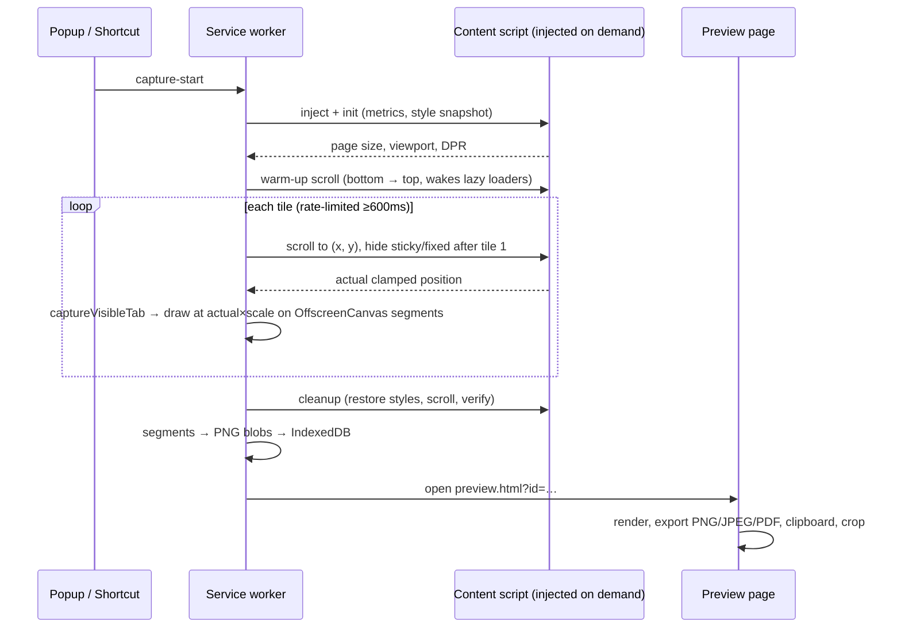

# FullPaged

**Full-page screenshots, 100% offline.** Capture any web page from top to bottom as PNG, JPEG or PDF — nothing ever leaves your device.

<p>
  
</p>

## Features

- 📸 **One-click full-page capture** — toolbar button or `Alt+Shift+S` (`⌥⇧S` on macOS)
- 🖼️ **PNG, JPEG (adjustable quality) and PDF** export, bundled jsPDF — no cloud conversion
- 📋 **Copy to clipboard** and **crop** in the local preview page
- 🔌 **Completely offline**: no network calls, no analytics, no telemetry, no accounts. An automated gate (`npm run check:offline`) fails the build if any network primitive appears in the shipped code
- 📐 **DPR & zoom aware** — output is exactly `page size × devicePixelRatio × zoom`
- 🧠 **Sticky/fixed handling** — headers, footers and sidebars appear exactly once; the page's DOM and styles are restored byte-identically after capture
- 🧩 **Huge pages** — beyond 16 384 device px the output is split into numbered segments (`-1`, `-2`, …)
- 🔒 **Minimal permissions**: `activeTab`, `scripting`, `storage`; optional `downloads` only if you use "Save As…"

## Install

**Chrome Web Store**: search for "FullPaged" (listing is pending).

**Unpacked (developer mode):**

```bash
npm install
npm run build
```

Then open `chrome://extensions`, enable *Developer mode*, click *Load unpacked* and select the `dist/` folder.

## Usage

1. Open any web page.
2. Click the FullPaged toolbar icon → **Capture full page** (or press `Alt+Shift+S`).
3. The preview tab opens: **Download** (your default format), **JPEG**, **PDF**, **Copy**, **Crop**, or **Save As…** (asks for the optional `downloads` permission on first use).

Defaults (format, JPEG quality, file name template `{domain}_{date}_{time}`, extra settle delay) live in the options page.

## Architecture



Key mechanics:

- **Stitching**: each tile is drawn at its *actual* scroll offset × scale; the clamped last tile overlaps the previous one and overwrites identical pixels — seams are impossible by construction (verified per-pixel by the test suite's coordinate-encoding ruler fixtures).
- **Scale** = captured bitmap width ÷ `window.innerWidth`, which folds DPR and browser zoom into one factor.
- **Rate limiting**: shots are spaced ≥600ms so Chrome's ~2 captures/sec quota is never hit (a stress test with 0ms settle delay asserts zero quota errors).
- **Segmentation**: output taller than 16 384 device px is split into per-segment canvases/PNGs; heights sum exactly to the page height.

## Development

```bash
npm install
npm run build
npm run test
```

`npm run test` = build (ship + test variant) → `eslint` + `tsc` → offline gate → manifest gate → 27 Playwright e2e tests against pixel-verifying fixtures (headful Chromium, extension loaded from `dist-test/` — see `docs/DECISIONS.md` for why the test build carries `<all_urls>`).

Useful scripts: `npm run zip` (store package), `npm run icons` (rasterize the SVG icon), `npm run check:store` (store asset sizes), `node scripts/similarity-scan.mjs` (clean-room check).

Project log: [docs/LEDGER.md](docs/LEDGER.md) · decisions: [docs/DECISIONS.md](docs/DECISIONS.md) · audit: [docs/FINAL_AUDIT.md](docs/FINAL_AUDIT.md).

## Known limitations

- **Inner scroll containers** (`overflow: auto` divs) are captured at their current scroll position only — the hidden part of the container is not expanded. Behavior is deterministic (covered by tests).
- **Iframes** are captured as rendered; cross-origin iframe content that requires scrolling is not expanded.
- **Very wide clipboard copies**: images taller than 16 384 device px copy only their top segment to the clipboard (downloads are unaffected).
- **file:// URLs** need "Allow access to file URLs" enabled for the extension.
- Pages that draw with WebGL using `preserveDrawingBuffer: false` may capture black in those regions (browser limitation).

## FAQ

**Does FullPaged send my screenshots anywhere?** No. There is no network code in the extension; a build gate enforces it and the privacy policy is one sentence: nothing is collected, nothing is transmitted.

**Why does it ask for the `downloads` permission?** Only if you click *Save As…* — regular downloads work without it. It is an optional permission, requested at that moment.

**Why does the capture scroll my page?** Chrome extensions can only capture the visible viewport; FullPaged scrolls in steps and stitches the tiles. Your scroll position and page styles are restored afterwards.

**PDF page size?** Pages are slices of the image at an A-portrait (√2) aspect, at 96 dpi → pt. Deterministic and testable, not a paper-size emulation.

## License

[MIT](LICENSE) · bundled third-party code: [THIRD_PARTY_LICENSES.md](THIRD_PARTY_LICENSES.md)
